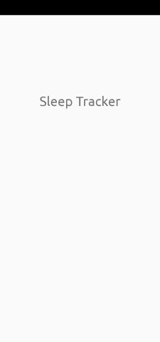
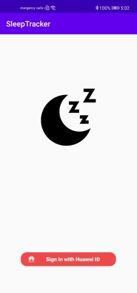
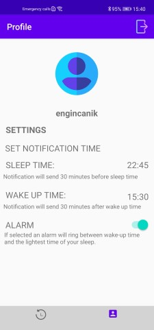
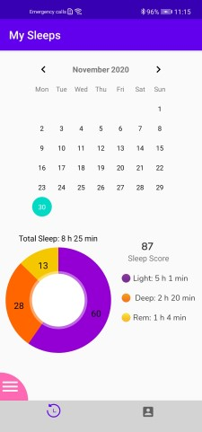
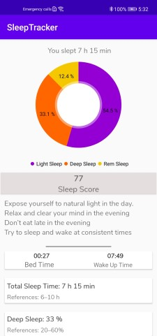
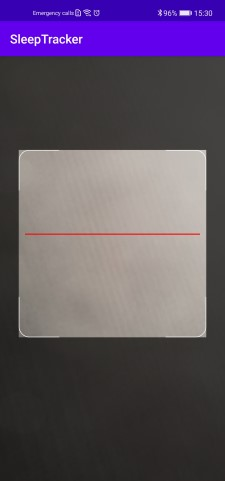

# Sleep Tracker Reference App
    

# Introduction

Sleep Tracker is a codelab for HMS kits for phones running with the android-based HMS service. Sleep Tracker provides sleep tracking ability by visualizing data coming from wearable Huawei devices like bands and smart-watches. Also provides an alarm clock and audios for helping to sleep. It is developed with Kotlin. Project architecture is MVVM. Auth Service/Account Kit, Health Kit, Push Kit, and Scan Kit is used. Also Joda Time, MPAndroidChart, Retrofit, Material Calendar View libraries used.

# HUAWEI Health Kit

HUAWEI Health Kit (Health Kit for short) allows ecosystem apps to access fitness and health data of users based on their HUAWEI ID and authorization. For consumers, Health Kit provides a mechanism for fitness and health data storage and sharing based on flexible authorization. For developers and partners, Health Kit provides a data platform and fitness and health open capabilities, so that they can build related apps and services based on a multitude of data types. Health Kit connects the hardware devices and ecosystem apps to provide consumers with health care, workout guidance, and ultimate service experience.

# Push Kit

HUAWEI Push Kit is a messaging service provided for you. It establishes a messaging channel from the cloud to devices. By integrating Push Kit, you can send messages to your apps on users' devices in real time. Push Kit allowed us to send notifications and keep track of them.

# Scan Kit

Scan Kit automatically detects, magnifies, and recognizes barcodes from a distance, and is also able to scan a very small barcode in the same way. It works even in suboptimal situations, such as under dim lighting or when the barcode is reflective, dirty, blurry, or printed on a cylindrical surface. This leads to a higher scanning success rate, and an improved user experience. With Scan Kit we were able to create an alarm clock that requires a QR code to be turned off.

# Account Kit

Account Kit provides you with simple, secure, and quick sign-in and authorization functions. Instead of entering accounts and passwords and waiting for authentication, users can just tap the Sign in with HUAWEI ID button to quickly and securely sign in to your app with their HUAWEI IDs. Account Kit helped us to use Huawei accounts with Auth Service.
    
# Auth Service

Auth Service provides SDKs and backend services, supports multiple authentication modes, and provides a powerful management console, enabling you to easily develop and manage user authentication. With Auth Service, user can use their Huawei ID to log in.

# What You Will Need

**Hardware Requirements**
- A computer that can run Android Studio.
- A Huawei phone for debugging.

**Software Requirements**
- Android SDK package
- HMS Core (APK) 5.0.0.300 or later version
- Android Studio 3.x or later version
- Java JDK 1.8 or later version
- EMUI 8.1 or later version

## Getting Started

- Before using Sleep Tracker code, check whether the Android Studio environment has been installed. 
- Download the Sleep Tracker project by zip or clone in Github.
- Wait for the gradle build in your project.

**Configuration**

1. Register and sign in to HUAWEI Developers.
2. Create a project and then create an app in the project, enter the project package name.
3. Go to Project Settings > Manage APIs, and enable necessary kits and services.
4. Go to Project Settings > General information, click Set next to Data storage location under Project information, and select a data storage location in the displayed dialog box.
5. Go to Developer Console > Health Kit and apply for Health Kit with selecting Sleep Read permission.
6. Download the agconnect-services.json file and place it to the app's root directory of the project.
7. Add the Maven repository address maven {url 'https://developer.huawei.com/repo/'} and plug-in class path 'com.huawei.agconnect:agcp:1.4.1.300' to the project-level build.gradle file.
8. Add apply plugin: 'com.huawei.agconnect' to the last line of the app-level build.gradle file.
9. Configure the dependencies in the app-level buildle.gradle file.
10. Synchronize the project.

  Necessary kits and services for this project:
- [**Health Kit**](https://developer.huawei.com/consumer/en/hms/huaweihealth/) - [**Account Kit**](https://developer.huawei.com/consumer/en/hms/huawei-accountkit/) - [**Push Kit**](https://developer.huawei.com/consumer/en/hms/huawei-pushkit/) - [**Auth Service**](https://developer.huawei.com/consumer/en/doc/development/AppGallery-connect-Guides/agc-auth-introduction-0000001053732605) - [**Scan Kit**](https://developer.huawei.com/consumer/en/hms/huawei-scankit/)

## Using the application

- Before you run the app, make sure that you have a working internet connection since the application uses Huawei Mobile Services. Otherwise, the app will not function correctly.

When a users start the application, login will welcome them. They need to login and link their health app with Sleep Tracker to application access of their sleep data. In main page today's sleep data will be shown if it is avaible. Then they can select another date from calendar to display that day's data. Users can select sleep and wake up time from profile page to get good night and good morning messages. Default time for wake up is 7 am and for sleep it is 11 pm. Users can active alarm functionality if they want to recieve and alarm clock on wake up time. They need to scan a qr code to turn off the alarm clock.

#  Screenshots

| **Splash Screen** | **Login Page** | **Profile Page** |
| ------ | ------ | ------ |
|  |  |  |

| **My Sleeps Page** | **Sleep Detail Page** | **QR Alarm** |
| ------ | ------ | ------ |
|  |  | 

## Libaries

 - Account Kit
 - Auth Service
 - Scan Kit
 - Push Kit
 - Material Components
 - Recyclerview
 - Cardview
 - Picasso
 - Koin
 - RxJava
 - MPAndroidChart
 - Material Calendar View
 - Joda Time
 - Retrofit

## Contributors

 - Engin Canik
 - Hakan Erbaş
